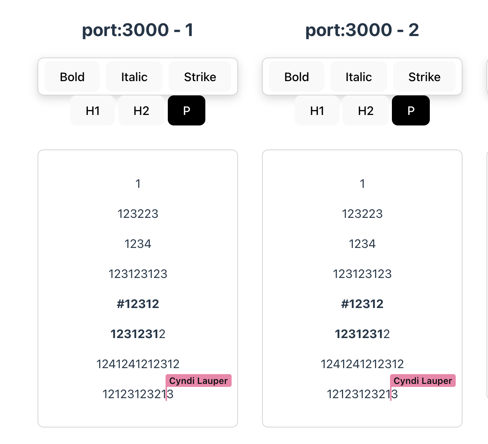

# Sample Client

This Svelte + Vite app demonstrates how to connect to the Hocuspocus server from a browser editor.



## Prerequisites
- [Bun](https://bun.sh/) 1.0 or newer
- A running Hocuspocus server (see the workspace root README for setup details)

## Install
```bash
bun install
```

## Run the dev server
```bash
bun run dev
```
Open the printed URL (defaults to `http://localhost:5173`) in your browser. The editor connects to the Hocuspocus backend automatically and displays collaborative editing features.
