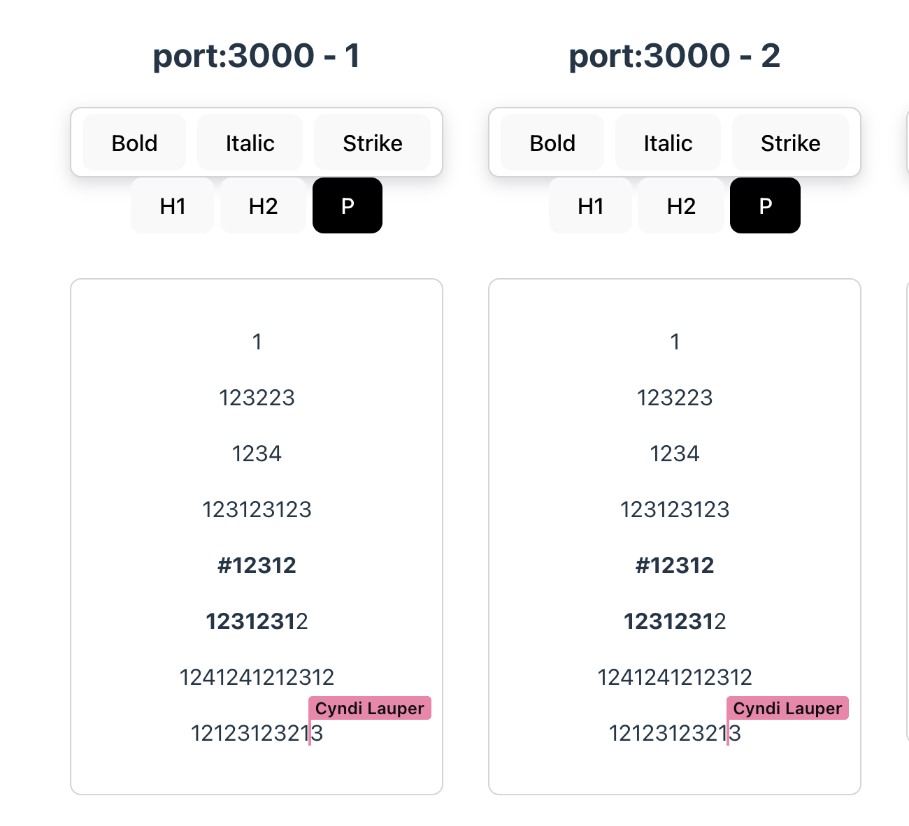

# Sample Client

This Svelte + Vite app demonstrates how to connect to the Hocuspocus server from a browser editor.
It uses the Hocuspocus JavaScript provider v4.



## Prerequisites
- [Bun](https://bun.sh/) 1.0 or newer
- A running Hocuspocus server (see the workspace root README for setup details)

## Install
```bash
bun install
```

## Run the dev server
```bash
bun run dev
```
Open the printed URL (defaults to `http://localhost:5173`) in your browser. The editor connects to the Hocuspocus backend automatically and displays collaborative editing features.

## Headless local e2e
Run the Rust example server and the Hocuspocus provider v4 client checks without opening a browser:

```bash
bun run e2e:hocuspocus:server
```

The command builds `example`, starts `target/debug/example` on `ws://127.0.0.1:3000`, runs the client checks, then stops the spawned server.

Expected evidence:
- `sessionAwareness=false`: two v4 providers on separate WebSockets emit `synced`, replicate a `Y.Text` update, and receive a remote awareness user.
- `sessionAwareness=true`: two v4 providers with the same document name share one `HocuspocusProviderWebsocket`, emit `synced`, and replicate a `Y.Text` update.

If a server is already running on port 3000, run only the client side:

```bash
bun run e2e:hocuspocus
```
